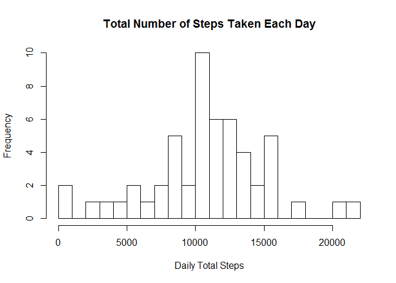
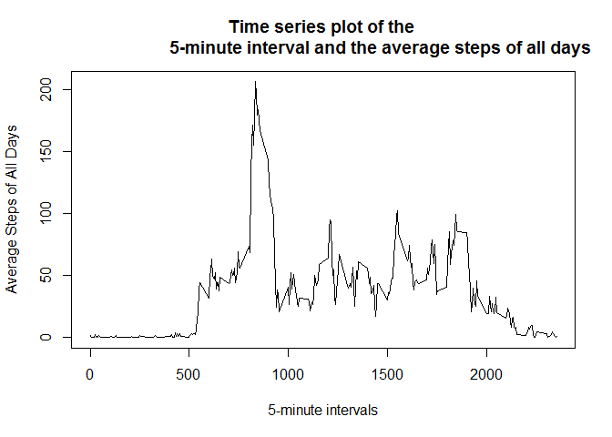
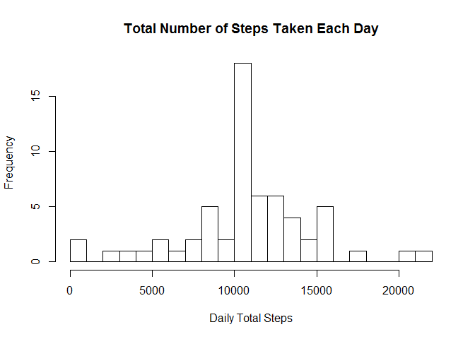
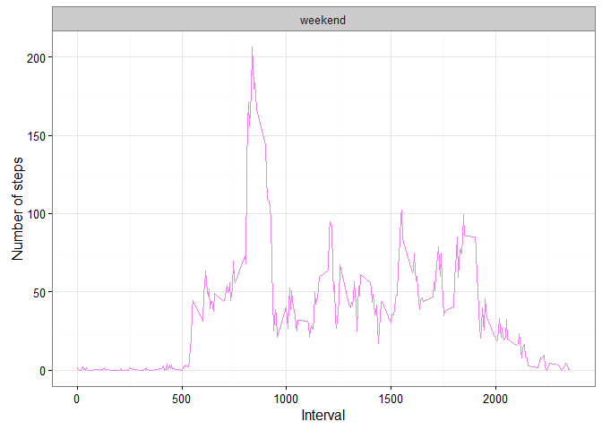

    ###Set to show R code.
    library(knitr)

    ## Warning: package 'knitr' was built under R version 3.2.5

    opts_chunk$set(echo=TRUE)
    ###load all the libraries
    library(dplyr)

    ## Warning: package 'dplyr' was built under R version 3.2.5

    ## 
    ## Attaching package: 'dplyr'

    ## The following objects are masked from 'package:stats':
    ## 
    ##     filter, lag

    ## The following objects are masked from 'package:base':
    ## 
    ##     intersect, setdiff, setequal, union

    library(ggplot2)

    ## Warning: package 'ggplot2' was built under R version 3.2.5

    ##Loading and processing the data
    ###Read the data to the data frame.
    unzip("activity.zip")
    activity<-read.csv("activity.csv")
    ###Calculate total rows that contain na.
    total_missing<-sum(is.na(activity))
    ###Seperate the dataset to two datasets, one contains the rows with NAs(act_NA), another one has no NAs(activity).Extract the rows with NAs, and remove the steps column.
    act_NA<-filter(activity,is.na(steps))
    act_NA<-select(act_NA,2,3)
    activity <- na.omit(activity)
    ###activity now contains no NA. Total number of missing values in the dataset is 2304.
    ##What is mean total number of steps taken per day?
    ###Calculate total number of steps taken per day, and make a histogram of the total number of steps taken each day.
    daily_sum<-activity %>% group_by(date) %>% summarize(total_steps=sum(steps))
    hist(daily_sum$total_steps, breaks=19, main="Total Number of Steps Taken Each Day", xlab="Daily Total Steps")

    mean_steps<-mean(daily_sum$total_steps)
    median_steps<-median(daily_sum$total_steps)
    ###Mean of the total number of steps taken per day is 1.076618910^{4}. Median of the total number of steps taken per day is 10765.
    ##What is the average daily activity pattern?
    ###Make a time series plot (i.e. type = "l") of the 5-minute interval (x-axis) and the average number of steps taken, averaged across all days (y-axis)
    mean_interval<-activity %>% group_by(interval) %>% summarize(mean_steps=mean(steps))
    with(mean_interval, plot(interval,mean_steps, type = "l", main="Time series plot of the 
                             5-minute interval and the average steps of all days", 
                             ylab="Average Steps of All Days", xlab="5-minute intervals"))

    most_active<-mean_interval[mean_interval$mean_steps==max(mean_interval$mean_steps),][1]
    ###The 835th 5-minute interval, on average across all the days in the dataset, contains the maximum number of steps.
    ##Imputing missing values
    ###Total number of missing values in the dataset is 2304.
    ###Use the mean for that 5-minute interval to fill in all of the missing values in the dataset. Merge act_NA(dataset with NAs) with the mean_interval table. Now the steps are replaced withthe mean for that 5-minute interval.
    act_NA<-merge(act_NA,mean_interval, by="interval")
    ###Reorder the new dataset to the same order as the activity DF. Rename the column to steps.
    act_NA<-arrange(act_NA, date, interval,mean_steps)
    colnames(act_NA)[3] <- "steps"
    ###Create a new dataset that is equal to the original dataset but with the missing data filled in by combining the new DF with activity.
    data<-rbind(act_NA, activity)
    data<-arrange(data, date, interval,steps)
    ###Make a histogram of the total number of steps taken each day and Calculate and report the mean and median total number of steps taken per day.
    new_daily_sum<-data %>% group_by(date) %>% summarize(total_steps=sum(steps))
    hist(new_daily_sum$total_steps, breaks=19, main="Total Number of Steps Taken Each Day", xlab="Daily Total Steps")

    ###After the NAs have been replaced by the mean for that 5-minute interval, the mean of the total number of steps taken per day is 1.076618910^{4}. The median of the total number of steps taken per day is 1.076618910^{4}.

    ###The mean is the same as the estimate from the first part of the assignment. The median has been shifted a little to the right. After imput the missing data with the mean of that five-minute interval the peak number of the daily steps is bigger.
    new_mean_steps<-mean(new_daily_sum$total_steps)
    new_median_steps<-median(new_daily_sum$total_steps)
    ##Are there differences in activity patterns between weekdays and weekends?
    ###Create a new factor variable in the dataset that has NAs been filled with two levels - "weekday" and "weekend" indicating whether a given date is a weekday or weekend day.
    data$date<-as.Date(data$date)
    data$Day_in_week<-ifelse((weekdays(data$date) %in% c("Monday","Tuesday","Wednesday","Thursday","Friday")), 
                             "weekday","weekend")
    ###Make a panel plot containing a time series plot (i.e. type = "l") of the 5-minute interval (x-axis) and the average number of steps taken, averaged across all weekday days or weekend days (y-axis).
    data_by_interval<-group_by(data,Day_in_week,interval)
    mean_data_interval<-data %>% group_by(Day_in_week,interval) %>% summarize(mean_steps=mean(steps))
    ggplot(mean_data_interval, aes(x=interval, y=mean_steps)) + 
      geom_line(color="violet") + 
      facet_wrap(~ Day_in_week, nrow=2, ncol=1) +
      labs(x="Interval", y="Number of steps") +
      theme_bw()

